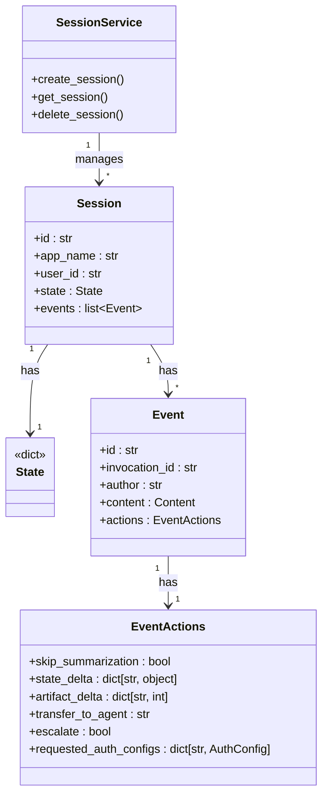
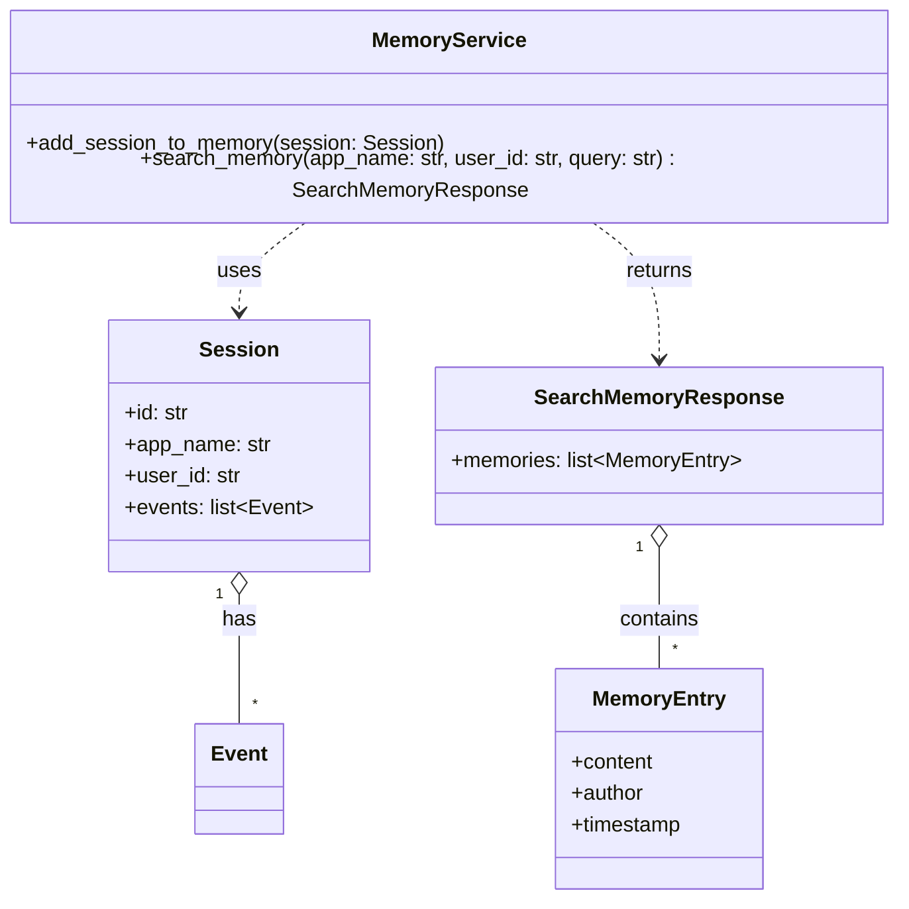

# llmabok2

```python
import warnings
# Ignore all warnings
warnings.filterwarnings("ignore")

import logging
logging.basicConfig(level=logging.ERROR)
```

## Part I. Google ADK

### 맛보기

1. chat_agent
    - 모듈 구성
    - adk web --reload --reload_agents
        - session, state, event 등 기본 개념을 설명한다.
2. math_agent
    - simple tool
    - tool calling에 대해 설명한다.
3. search_agent
    - built-in tool

### ADK Runtime

4. math_agent
    - Runtime 구조: runner, session/session_service, event loop (event <-- message)

asyncio에 대한 간단한 설명이 필요하다.
generator에 대한 설명이 필요하다.

5. country_agent
    - session, state의 개념
    - Runtime 기본 구성 요소에 대해 설명한다(https://google.github.io/adk-docs/runtime/)
        - Runner, Execution Logics (Agent), Event, Services, Session, Invocation 동작 flow도 설명한다.

        
        

### Agents
- LLMAgent
    - name, model, description, instruction
    - instruction guide
    - Planner: Assign a BasePlanner instance to enable multi-step reasoning and planning before execution. There are two main planners: BuiltInPlanner, PlanReActPlanner

6. country_agent (agent2.py)
    - structured data: input, output scheme, output key
        - input scheme는 tool로 사용되는 경우
        - instruction에 잘 작성해야 한다.
    - include_contents='none' <-- 대화 history를 LLM에 보내지 않는다.

7. code_agent
    - Code Execution: Provide a BaseCodeExecutor instance to allow the agent to execute code blocks found in the LLM's response.
    - 프로그램을 생성해서 계산하고, 결과를 반환한다.

- Workflow agent
    - SequentialAgent
    - LoopAgent
    - ParallelAgent

LoopAgent의 코드를 보면, event.actions.escalate가 True이면 더이상 실행하지 않는다.

8. story_agent
    - SequentialAgent, LoopAgent로 구성해 본다.

- Custom agent
While the standard Workflow Agents (SequentialAgent, LoopAgent, ParallelAgent) cover common orchestration patterns, you'll need a Custom agent when your requirements include:
    - Conditional Logic: Executing different sub-agents or taking different paths based on runtime conditions or the results of previous steps.
    - Complex State Management: Implementing intricate logic for maintaining and updating state throughout the workflow beyond simple sequential passing.
    - External Integrations: Incorporating calls to external APIs, databases, or custom libraries directly within the orchestration flow control.
    - Dynamic Agent Selection: Choosing which sub-agent(s) to run next based on dynamic evaluation of the situation or input.
    - Unique Workflow Patterns: Implementing orchestration logic that doesn't fit the standard sequential, parallel, or loop structures.

async def _run_async_impl(self, ctx: InvocationContext) -> AsyncGenerator[Event, None]:

Generator에 대한 설명이 필요하다.
- return 대신 yield를 사용한다.

list comprehension --> squares = [x * x for x in range(5)]
print(squares) # [0, 1, 4, 9, 16]
generator comprehension --> squares = (x * x for x in range(5))
print(squares) # <generator object <genexpr> at 0x0000016AF9842400>
for n in squares: print(n)

```python
def count():
    print("a")
    yield 1
    print("b")
    yield 2
    print("c")
    yield 3
    print("d")

for n in count(): print(n)
```

동일한 결과를 내도록 해보는게 좋겠다.

9. JsonInputAgent, LambdaAgent
--> calc_agent x --> x + 1 --> (x + 1) ** 2

10. WhileAgent
--> fibonacci_agent

-------------
[실습] problem solver
- 주어진 알고리즘 문제를 해결하는 프로그램을 작성하라.
  - 작성된 알고리즘의 동작을 검증하고, 문제점을 파악하고, 해결하도록 한다.
-------------


model deployment
<<device>> <<private>> <<public>>

1) local device
2) private cloud --> minikube (vllm)
   
-------------

### session / state / memory / artifact
- Session: The Current Conversation Thread represents a single
    - managed by SessionService
- State (session.state): Data Within the Current Conversation
- Memory: Searchable, Cross-Session Information
    - managed by MemoryService

- Session
    - Identification (appName, userId, id)
    - state
    - events: list[Event]
- InMemorySessionService -> SessionService
    - Persistence: None. All conversation data is lost if the application restarts.
    - create_session, get_session, delete_session, ...
        - session_id가 주어지지 않으면 UUID로 만들어 진다.
- VertexAiSessionService
    - Persistence: Yes. Data is managed reliably and scalably via Vertex AI Agent Engine.
- DatabaseSessionService
    - Connects to a relational database (e.g., PostgreSQL, MySQL, SQLite) to store session data persistently in tables.
    - Persistence: Yes. Data survives application restarts.

SessionService는 Session을 관리한다. Session은 하나의 State와 Event list를 가진다.


```python
class EventActions {
  skip_summarization: Optional[bool] = None
  """If true, it won't call model to summarize function response.
  Only used for function_response event.
  """

  state_delta: dict[str, object] = Field(default_factory=dict)
  """Indicates that the event is updating the state with the given delta."""

  artifact_delta: dict[str, int] = Field(default_factory=dict)
  """Indicates that the event is updating an artifact. key is the filename,
  value is the version."""

  transfer_to_agent: Optional[str] = None
  """If set, the event transfers to the specified agent."""

  escalate: Optional[bool] = None
  """The agent is escalating to a higher level agent."""

  requested_auth_configs: dict[str, AuthConfig] = Field(default_factory=dict)
  """Authentication configurations requested by tool responses.
   
}
```

MemoryService는 Session 정보를 저장한다. (app_name, user_id, session_id)에 session의 content를 저장한다.
search_memory(app_name, user_id, query)는 (app_name, user_id)에 저장된 session에 대해서 query에 연관성이 높은 session content를 반환한다. InMemoryMemoryService에서는 keyword 포함 관계 정도만 체크한다.
반환은 SearchMemoryResponse 객체로 반환하는데, memories: list[MemoryEntity]이고, MemoryEntity는 author, content, timestamp를 속성으로 가진다.
따라서, 메모리는 모든 session을 통합적으로 관리한다.


이전 대화의 세션을 저장하고,
이전 대화의 내용을 이용할 수 있도록 한다.





- State Prefixes: Remember the standard state prefixes:
    - app:*: Shared across all users of the application.
    - user:*: Specific to the current user across all their sessions.
    - (No prefix): Specific to the current session.
    - temp:*: Temporary, not persisted across invocations (useful for passing data within a single run call but generally less useful inside a tool context which operates between LLM calls).

```py
from google.adk.tools import ToolContext, FunctionTool

def update_user_preference(preference: str, value: str, tool_context: ToolContext):
    """Updates a user-specific preference."""
    user_prefs_key = "user:preferences"
    # Get current preferences or initialize if none exist
    preferences = tool_context.state.get(user_prefs_key, {})
    preferences[preference] = value
    # Write the updated dictionary back to the state
    tool_context.state[user_prefs_key] = preferences
    print(f"Tool: Updated user preference '{preference}' to '{value}'")
    return {"status": "success", "updated_preference": preference}

pref_tool = FunctionTool(func=update_user_preference)
```


- state 변경 --> SessionService를 통해야 한다.
    - 따라서, EventActions를 통해야 한다.
        ```python
        # --- Create Event with Actions ---
        actions_with_update = EventActions(state_delta=state_changes)
        # This event might represent an internal system action, not just an agent response
        system_event = Event(
            invocation_id="inv_login_update",
            author="system", # Or 'agent', 'tool' etc.
            actions=actions_with_update,
            timestamp=current_time
            # content might be None or represent the action taken
        )

        # --- Append the Event (This updates the state) ---
        await session_service.append_event(session, system_event)
        ```
        - JsonInputAgent에서 json data를 session에 update하는 Event를 발생시킨다.
    - Tool이나 Callback에서는 ToolContext, CallbackContext에 state를 변경하면 자동으로 적용된다.
        - Toll/Callback이 처리되면, Event가 생성된다. 이때, state_delta가 자동으로 적용된다.

- Best Practices for State Design Recap
    - Minimalism: Store only essential, dynamic data.
    - Serialization: Use basic, serializable types.
    - Descriptive Keys & Prefixes: Use clear names and appropriate prefixes (user:, app:, temp:, or none).
    - Shallow Structures: Avoid deep nesting where possible.
    - Standard Update Flow: Rely on append_event.


- memory / memory service
- InMemoryMemoryService

```python
from google.adk.memory import InMemoryMemoryService
memory_service = InMemoryMemoryService()

await memory_service.add_session_to_memory(completed_session1)

results = await memory_service.search_memory(app_name: str, user_id: str, query: str)
### basic keyword matching
```

- VertexAiMemoryBankService

-------------
- Artifact: An Artifact is essentially a piece of binary data (like the content of a file) identified by a unique filename string within a specific scope (session or user). Each time you save an artifact with the same filename, a new version is created.
- InMemoryArtifactService

pdf 파일을 로드해서, 요약하는 app을 만들어 보자.

-------------
- Tools
    - Function Tools
        - Functions/Methods
        - Agents-as-Tools
        - Long Running Function Tools - async
    - Built-in Tools
    - Third-Party Tools
        - 

- ToolContext
    - state
        - toolcontext.state에 write를 하면, actions에 state_delta에 저장되어 전달된다.
    - actions: EventActions
        - skip_summarization: Optional[bool] = None
        """If true, it won't call model to summarize function response.
        Only used for function_response event.
        """
        - state_delta: dict[str, object] = Field(default_factory=dict)
        """Indicates that the event is updating the state with the given delta."""
        - artifact_delta: dict[str, int] = Field(default_factory=dict)
        """Indicates that the event is updating an artifact. key is the filename,
        value is the version."""
        - transfer_to_agent: Optional[str] = None
        """If set, the event transfers to the specified agent."""
        - escalate: Optional[bool] = None
        """The agent is escalating to a higher level agent."""
        LoopAgent를 빠져나간다.


date_agent


evaluation

rag --- vector store.


MAS & patterns

